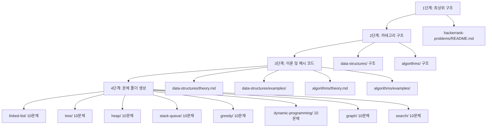
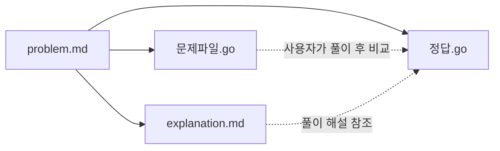

# 설계 문서: HackerRank 문제 학습 가이드

## 개요

HackerRank에서 백준 실버3~골드4 수준의 문제를 선별하여, 자료구조와 알고리즘 두 대분류로 나눈 학습 가이드를 구성한다. 기존 워크스페이스의 파일 패턴(`problem.md`, `explanation.md`, `문제파일.go`, `정답.go`)과 한국어 문서 작성 방식을 그대로 유지하면서, `hackerrank-problems/` 최상위 폴더 아래에 총 80개 문제(8개 서브카테고리 × 10문제)를 체계적으로 배치한다.

이 프로젝트는 소프트웨어 애플리케이션이 아닌 콘텐츠 생성 프로젝트이므로, 설계의 핵심은 폴더/파일 구조, 콘텐츠 템플릿, 생성 순서에 있다.

## 아키텍처

### 전체 폴더 구조

```
hackerrank-problems/
├── README.md                          # 프로젝트 개요
├── data-structures/
│   ├── README.md                      # 자료구조 카테고리 개요
│   ├── theory.md                      # 자료구조 이론 (연결 리스트, 트리, 힙, 스택/큐)
│   ├── examples/
│   │   ├── linked_list.go             # 연결 리스트 기본 연산 예시
│   │   ├── tree.go                    # 이진 트리 기본 연산 예시
│   │   └── heap.go                    # 힙(우선순위 큐) 기본 연산 예시
│   └── problems/
│       ├── linked-list/               # 10문제
│       │   ├── 01-easy-print-the-elements-of-a-linked-list/
│       │   │   ├── problem.md
│       │   │   ├── explanation.md
│       │   │   ├── 문제파일.go
│       │   │   └── 정답.go
│       │   ├── 02-easy-insert-a-node-at-the-tail/
│       │   └── ... (10문제)
│       ├── tree/                      # 10문제
│       ├── heap/                      # 10문제
│       └── stack-queue/               # 10문제
└── algorithms/
    ├── README.md                      # 알고리즘 카테고리 개요
    ├── theory.md                      # 알고리즘 이론 (그리디, DP, 그래프, 탐색)
    ├── examples/
    │   ├── greedy.go                  # 그리디 알고리즘 기본 패턴 예시
    │   ├── dp.go                      # 동적 프로그래밍 기본 패턴 예시
    │   ├── graph.go                   # 그래프 탐색(BFS, DFS) 기본 패턴 예시
    │   └── search.go                  # 이진 탐색 기본 패턴 예시
    └── problems/
        ├── greedy/                    # 10문제
        ├── dynamic-programming/       # 10문제
        ├── graph/                     # 10문제
        └── search/                    # 10문제
```

### 생성 순서 및 의존성



생성 순서 근거:
1. 최상위 README.md는 전체 구조를 참조하므로 가장 먼저 생성
2. 카테고리 README.md는 하위 문제 목록을 참조하므로 구조 확정 후 생성
3. theory.md와 examples/는 문제와 독립적이므로 병렬 생성 가능
4. 문제 폴더는 서브카테고리별로 독립적이므로 병렬 생성 가능

## 컴포넌트 및 인터페이스

### 콘텐츠 컴포넌트 정의

이 프로젝트의 "컴포넌트"는 각 파일 유형의 콘텐츠 템플릿이다.

#### 1. Root README.md 템플릿

```markdown
# HackerRank 문제 풀이

HackerRank에서 선별한 자료구조와 알고리즘 문제 학습 가이드이다.
백준 실버3~골드4 수준에 해당하는 문제를 난이도별로 구성하였다.

## 구성

| 대분류 | 세부 주제 | 문제 수 |
| --- | --- | --- |
| 자료구조 | 연결 리스트, 트리, 힙, 스택/큐 | 40문제 |
| 알고리즘 | 그리디, 동적 프로그래밍, 그래프, 탐색 | 40문제 |

## 난이도 분포

- 하(Easy): 약 40%
- 중(Medium): 약 40%
- 상(Hard): 약 20%

## 카테고리

- [자료구조](data-structures/)
- [알고리즘](algorithms/)
```

#### 2. Category README.md 템플릿

```markdown
# {카테고리명}

{카테고리 설명}

## 구성

- `theory.md` - 이론 및 개념 설명
- `examples/` - 기본 구현 예시 코드
- `problems/` - 연습 문제 및 풀이

## 세부 주제

| 주제 | 문제 수 | 난이도 분포 |
| --- | --- | --- |
| {주제1} | 10문제 | 하/중/상 혼합 |
| {주제2} | 10문제 | 하/중/상 혼합 |
| ... | ... | ... |
```

#### 3. theory.md 템플릿

기존 `01-implementation-and-simulation/theory.md` 패턴을 따른다:

```markdown
# {주제명}

## 개념
{각 세부 주제의 정의와 기본 개념}

## 동작 원리
{각 자료구조/알고리즘의 동작 방식 설명}

### 자주 사용되는 기법
{관련 기법 목록}

## 복잡도
{시간/공간 복잡도 비교 표}

## 적합한 문제 유형
{어떤 문제에 적합한지 설명}

## 단계별 추적 (Trace)
{예시를 통한 단계별 실행 과정}

## 실전 팁
### 활용 노하우
### 자주 하는 실수
### 엣지 케이스 주의사항

## 관련 알고리즘 비교
{유사 알고리즘과의 비교 표}
```

#### 4. problem.md 템플릿

기존 `01-easy-matrix-rotation/problem.md` 패턴을 따른다:

```markdown
# {문제 제목 (한국어)}

**난이도:** {하/중/상}
**출처:** [{HackerRank 문제명}]({HackerRank URL})

## 문제 설명
{문제 내용을 한국어로 번역/설명}

## 입력 형식
{입력 형식 설명}

## 출력 형식
{출력 형식 설명}

## 제약 조건
{제약 조건 목록}

## 예제

### 예제 입력 1
```
{예제 입력}
```

### 예제 출력 1
```
{예제 출력}
```
```

#### 5. explanation.md 템플릿

기존 `01-easy-matrix-rotation/explanation.md` 패턴을 따른다:

```markdown
# {문제 제목} - 해설

## 접근 방식
{단계별 접근 방법}

## 핵심 아이디어
{알고리즘의 핵심 아이디어 설명}

## 복잡도 분석
| 구분 | 복잡도 |
| --- | --- |
| 시간 복잡도 | O(...) |
| 공간 복잡도 | O(...) |

{복잡도 근거 설명}

## 대안적 접근
{다른 풀이 방법 소개}
```

#### 6. 문제파일.go 템플릿

기존 `01-easy-matrix-rotation/문제파일.go` 패턴을 따른다:

```go
package main

import (
	"bufio"
	"fmt"
	"os"
)

// {함수명}은(는) {함수 설명}
//
// [매개변수]
//   - {param}: {설명}
//
// [반환값]
//   - {type}: {설명}
func {함수명}({매개변수}) {반환타입} {
	// 여기에 코드를 작성하세요
	return {기본값}
}

func main() {
	reader := bufio.NewReader(os.Stdin)
	writer := bufio.NewWriter(os.Stdout)
	defer writer.Flush()

	// 입력 처리
	// ...

	// 핵심 함수 호출
	// result := {함수명}(...)

	// 결과 출력
	// ...
}
```

#### 7. 정답.go 템플릿

기존 `01-easy-matrix-rotation/정답.go` 패턴을 따른다:

```go
package main

import (
	"bufio"
	"fmt"
	"os"
)

// {함수명}은(는) {함수 설명}
//
// [매개변수]
//   - {param}: {설명}
//
// [반환값]
//   - {type}: {설명}
//
// [알고리즘 힌트]
//   {알고리즘 접근 방식 힌트}
func {함수명}({매개변수}) {반환타입} {
	// {단계 1 설명}
	// ...구현 코드...

	// {단계 2 설명}
	// ...구현 코드...

	return result
}

func main() {
	reader := bufio.NewReader(os.Stdin)
	writer := bufio.NewWriter(os.Stdout)
	defer writer.Flush()

	// 입력 처리
	// ...

	// 핵심 함수 호출
	result := {함수명}(...)

	// 결과 출력
	// ...
}
```

#### 8. examples/ Go 파일 템플릿

기존 `01-implementation-and-simulation/examples/simulation.go` 패턴을 따른다:

```go
package main

import "fmt"

// {주제} - {설명}
// {세부 설명}
// 시간 복잡도: O(...)
// 공간 복잡도: O(...)

// {함수명} 함수는 {동작 설명}
func {함수명}({매개변수}) {반환타입} {
	// {구현}
}

func main() {
	// 예시 실행
	fmt.Println("--- {예시 제목} ---")
	// ...실행 및 결과 출력...
}
```

## 데이터 모델

### 문제 목록 데이터

각 서브카테고리의 문제 목록은 요구사항 4~11에 명시되어 있다. 아래는 서브카테고리별 문제 수와 난이도 분포 요약이다:

| 서브카테고리 | Easy | Medium | Hard | 합계 |
| --- | --- | --- | --- | --- |
| linked-list | 5 | 4 | 1 | 10 |
| tree | 5 | 4 | 1 | 10 |
| heap | 3 | 4 | 3 | 10 |
| stack-queue | 4 | 4 | 2 | 10 |
| greedy | 4 | 4 | 2 | 10 |
| dynamic-programming | 3 | 5 | 2 | 10 |
| graph | 3 | 5 | 2 | 10 |
| search | 4 | 4 | 2 | 10 |
| **합계** | **31** | **34** | **15** | **80** |

### 폴더 명명 규칙

- 문제 폴더: `{번호:02d}-{난이도}-{영문-kebab-case}`
  - 번호: 01~10 (2자리 zero-padding)
  - 난이도: `easy`, `medium`, `hard`
  - 문제명: HackerRank 문제 제목의 kebab-case 변환

### 파일 간 관계



- `problem.md`: 문제 정의 (입력)
- `문제파일.go`: 빈 템플릿 (사용자 작업 공간)
- `정답.go`: 완전한 정답 (참조)
- `explanation.md`: 풀이 해설 (학습 자료)


## 정확성 속성 (Correctness Properties)

*속성(Property)이란 시스템의 모든 유효한 실행에서 참이어야 하는 특성 또는 동작을 말한다. 속성은 사람이 읽을 수 있는 명세와 기계가 검증할 수 있는 정확성 보장 사이의 다리 역할을 한다.*

이 프로젝트는 콘텐츠 생성 프로젝트이므로, 정확성 속성은 생성된 파일 구조와 콘텐츠의 일관성을 검증하는 데 초점을 맞춘다.

### Property 1: 문제 폴더 구조 완전성

*For any* 문제 폴더(80개 전체), 해당 폴더는 정확히 `problem.md`, `explanation.md`, `문제파일.go`, `정답.go` 4개 파일을 포함해야 하며, 폴더명은 `{번호:02d}-{easy|medium|hard}-{kebab-case}` 형식을 따라야 한다.

**Validates: Requirements 12.1, 12.2, 12.5**

### Property 2: problem.md 필수 섹션 포함

*For any* `problem.md` 파일, 해당 파일은 난이도, HackerRank 출처 URL(`hackerrank.com` 도메인), 문제 설명, 입력 형식, 출력 형식, 제약 조건, 예제 섹션을 모두 포함해야 한다.

**Validates: Requirements 4.2, 5.2, 6.2, 7.2, 8.2, 9.2, 10.2, 11.2, 12.3**

### Property 3: explanation.md 필수 섹션 포함

*For any* `explanation.md` 파일, 해당 파일은 접근 방식, 핵심 아이디어, 복잡도 분석, 대안적 접근 섹션을 모두 포함해야 한다.

**Validates: Requirements 12.4**

### Property 4: 문제파일.go 템플릿 규격

*For any* `문제파일.go` 파일, 해당 파일은 (1) 핵심 함수 시그니처와 매개변수/반환값 주석, (2) 함수 본문에 `// 여기에 코드를 작성하세요` 주석, (3) `bufio.NewReader`와 `bufio.NewWriter`를 사용하는 완전한 `main` 함수를 포함해야 한다.

**Validates: Requirements 13.1, 13.2, 13.3**

### Property 5: 정답.go 완전성

*For any* `정답.go` 파일, 해당 파일은 (1) 핵심 함수의 완전한 구현(비어있지 않은 함수 본문), (2) 단계별 한국어 주석, (3) `bufio.NewReader`와 `bufio.NewWriter`를 사용하는 I/O 처리, (4) `[알고리즘 힌트]` 섹션이 포함된 함수 주석을 포함해야 한다.

**Validates: Requirements 13.4, 13.5, 13.6**

### Property 6: 한국어 문서 작성

*For any* 마크다운 파일(`.md`) 또는 Go 소스 파일(`.go`) 내의 주석, 해당 텍스트는 한국어 문자(유니코드 한글 범위)를 포함해야 한다.

**Validates: Requirements 14.1, 14.2**

### Property 7: 난이도 혼합 배치

*For any* 서브카테고리 폴더(8개 전체), 해당 폴더 내 10개 문제는 `easy`, `medium`, `hard` 중 최소 2가지 이상의 난이도를 포함해야 한다.

**Validates: Requirements 4.3, 5.3, 6.3, 7.3, 8.3, 9.3, 10.3, 11.3**

### Property 8: 예시 코드 규격

*For any* `examples/` 디렉토리 내 Go 파일, 해당 파일은 (1) 파일 상단 주석에 시간 복잡도와 공간 복잡도 명시, (2) `main` 함수에서 예시 실행 결과 출력, (3) 각 함수에 한국어 주석을 포함해야 한다.

**Validates: Requirements 15.8, 15.9, 15.10**

## 에러 처리

이 프로젝트는 콘텐츠 생성 프로젝트이므로 런타임 에러 처리보다는 콘텐츠 품질 관리에 초점을 맞춘다.

### 콘텐츠 생성 시 주의사항

1. **HackerRank URL 유효성**: 각 문제의 HackerRank URL이 실제 존재하는 문제를 가리키는지 확인한다. 요구사항에 명시된 URL을 그대로 사용한다.
2. **Go 코드 컴파일 가능성**: 모든 `.go` 파일은 `go build` 명령으로 컴파일 가능해야 한다. `문제파일.go`는 빈 함수 본문이지만 기본 반환값을 포함하여 컴파일 에러를 방지한다.
3. **문제 번호 중복 방지**: 각 서브카테고리 내에서 01~10 번호가 중복되지 않도록 한다.
4. **인코딩**: 모든 파일은 UTF-8 인코딩으로 작성하여 한국어 문자가 올바르게 표시되도록 한다.

### Go 코드 품질 기준

- `문제파일.go`: 컴파일 가능하되, 핵심 함수는 `nil` 또는 기본값을 반환
- `정답.go`: 컴파일 가능하고, 올바른 결과를 출력하는 완전한 구현
- `examples/*.go`: 컴파일 및 실행 가능하며, 예상 출력을 생성

## 테스트 전략

### 이중 테스트 접근법

이 프로젝트는 콘텐츠 생성 프로젝트이므로, 테스트는 생성된 콘텐츠의 구조적 정확성과 일관성을 검증하는 데 초점을 맞춘다.

#### 단위 테스트 (구체적 예시 검증)

- 특정 파일의 존재 여부 확인 (예: `hackerrank-problems/data-structures/examples/linked_list.go` 존재)
- 특정 문제 폴더의 구조 확인 (예: `01-easy-print-the-elements-of-a-linked-list/` 내 4개 파일)
- 특정 `정답.go`의 컴파일 가능성 확인

#### 속성 기반 테스트 (범용 속성 검증)

속성 기반 테스트 라이브러리: Go의 `testing/quick` 또는 셸 스크립트 기반 검증

각 테스트는 최소 100회 반복으로 구성하며, 설계 문서의 속성을 참조하는 태그를 포함한다.

태그 형식: **Feature: hackerrank-problems, Property {번호}: {속성 설명}**

- **Property 1 테스트**: 80개 문제 폴더 전체를 순회하며 4개 파일 존재 및 폴더명 형식 검증
- **Property 2 테스트**: 80개 `problem.md` 파일을 순회하며 필수 섹션(난이도, URL, 문제 설명, 입력/출력 형식, 제약 조건, 예제) 포함 여부 검증
- **Property 3 테스트**: 80개 `explanation.md` 파일을 순회하며 필수 섹션 포함 여부 검증
- **Property 4 테스트**: 80개 `문제파일.go` 파일을 순회하며 빈 함수 본문, 플레이스홀더 주석, main 함수 포함 여부 검증
- **Property 5 테스트**: 80개 `정답.go` 파일을 순회하며 완전한 구현, bufio 사용, 알고리즘 힌트 포함 여부 검증
- **Property 6 테스트**: 모든 `.md` 및 `.go` 파일을 순회하며 한국어 문자 포함 여부 검증
- **Property 7 테스트**: 8개 서브카테고리 폴더를 순회하며 난이도 혼합 여부 검증
- **Property 8 테스트**: 7개 예시 Go 파일을 순회하며 복잡도 주석, main 함수, 한국어 주석 포함 여부 검증

#### 수동 검증

- HackerRank URL 접근 가능성 확인
- 한국어 문서의 문체 일관성 확인
- 문제 난이도가 백준 실버3~골드4 범위에 적합한지 확인
