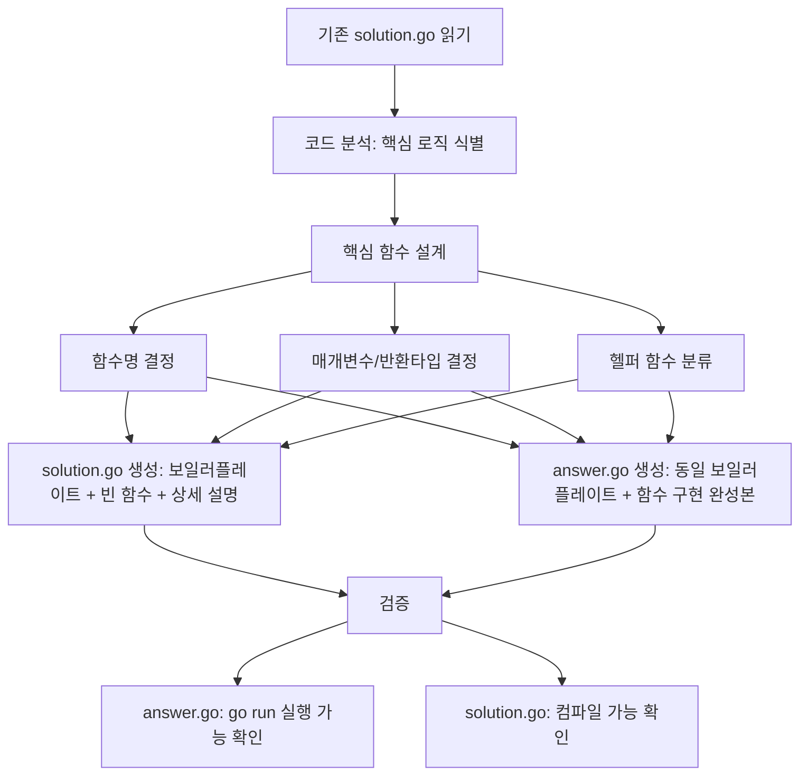

# 설계 문서: HackerRank 스타일 리팩토링

## 개요 (Overview)

67개 알고리즘 폴더(01~67번)의 201개 문제 폴더에 있는 기존 solution.go를 HackerRank 스타일로 분리한다. solution.go는 보일러플레이트(입출력 처리) + 빈 핵심 함수 시그니처(상세 한국어 설명 포함)로 재구성하고, answer.go는 동일한 보일러플레이트 + 핵심 함수 구현 완성본으로 작성한다.

학습자는 solution.go를 열면 입출력이 이미 준비된 상태에서 핵심 알고리즘 함수만 구현하면 되고, 막히면 answer.go를 열어 같은 구조에서 함수 구현만 참고할 수 있다.

### 핵심 설계 결정

1. **기존 solution.go 분석 → 핵심 함수 추출 → solution.go/answer.go 쌍 생성**: 기존 코드를 분석하여 핵심 알고리즘 로직을 함수로 추출한다. solution.go는 보일러플레이트 + 빈 함수, answer.go는 동일한 보일러플레이트 + 함수 구현 완성본으로 작성한다.
2. **핵심 함수 추출 전략**: 각 문제마다 알고리즘 로직이 다르므로, AI 에이전트가 기존 solution.go를 분석하여 핵심 로직을 함수로 추출한다. 수동 규칙 기반 파싱은 201개 파일의 다양한 패턴을 커버하기 어렵다.
3. **일관된 패턴 적용**: 모든 신규 solution.go는 동일한 구조(package → import → 핵심 함수 시그니처 → main 함수)를 따른다.

## 아키텍처 (Architecture)

### 리팩토링 전후 파일 구조 비교

```text
리팩토링 전:                          리팩토링 후:
XX-algorithm/                         XX-algorithm/
└── problems/                         └── problems/
    └── 01-easy-problem/                  └── 01-easy-problem/
        ├── problem.md                        ├── problem.md
        ├── solution.go  (완전한 풀이)        ├── solution.go  (보일러플레이트 + 빈 함수 + 상세 설명)
        └── explanation.md                    ├── answer.go    (동일 보일러플레이트 + 함수 구현 완성본)
                                              └── explanation.md
```

### 리팩토링 처리 흐름



### 핵심 함수 추출 전략

201개 파일은 각각 다른 알고리즘 로직을 포함하므로, 핵심 함수 추출은 다음 분류 기준을 따른다:

#### 패턴 A: 단일 변환 함수 (가장 흔함)

입력 데이터를 받아 결과를 반환하는 순수 함수로 추출 가능한 경우.

```go
// 기존 solution.go (행렬 회전 예시)
func main() {
    // ... 입력 읽기 ...
    // 핵심 로직: 행렬 회전
    rotated := make([][]int, n)
    for i := 0; i < n; i++ { ... }
    // ... 출력 ...
}

// 신규 solution.go
// rotateMatrix는 N×N 행렬을 시계 방향으로 90도 회전한 결과를 반환한다
func rotateMatrix(matrix [][]int, n int) [][]int {
    // 여기에 코드를 작성하세요
    return nil
}
func main() {
    // ... 입력 읽기 ...
    result := rotateMatrix(matrix, n)
    // ... 출력 ...
}
```

#### 패턴 B: 탐색/판별 함수

조건을 만족하는 값을 찾거나 참/거짓을 판별하는 경우.

```go
// 신규 solution.go (합이 되는 쌍 찾기 예시)
// findSumPair는 배열에서 합이 target인 두 수를 찾아 반환한다
func findSumPair(arr []int, target int) (int, int, bool) {
    // 여기에 코드를 작성하세요
    return 0, 0, false
}
```

#### 패턴 C: 헬퍼 함수가 있는 경우

기존 코드에 main 외부 함수가 있으면, 알고리즘 핵심 로직 함수만 빈 시그니처로 제공하고 유틸리티 헬퍼는 보일러플레이트에 포함한다.

```go
// 기존: sortString (유틸리티) + main 내 그룹핑 로직
// 신규 solution.go:
func sortString(s string) string { /* 기존 코드 유지 */ }

// groupAnagrams는 문자열 배열을 아나그램 그룹으로 분류한다
func groupAnagrams(words []string) [][]string {
    // 여기에 코드를 작성하세요
    return nil
}
```

#### 패턴 D: 시뮬레이션/상태 변경 함수

상태를 직접 변경하는 시뮬레이션 문제의 경우, 상태 구조체와 함께 핵심 함수를 설계한다.

```go
// 신규 solution.go (로봇 시뮬레이션 예시)
type Robot struct { r, c, d int }

// simulateRobots는 로봇들에게 명령을 수행한 후 최종 상태를 반환한다
func simulateRobots(robots []Robot, commands string, R, C int) []Robot {
    // 여기에 코드를 작성하세요
    return robots
}
```

### 함수명 명명 규칙

| 문제 유형 | 함수명 패턴 | 예시 |
| --- | --- | --- |
| 변환/생성 | 동사 + 대상 | `rotateMatrix`, `buildSpiralMatrix` |
| 탐색/검색 | find/search + 대상 | `findSumPair`, `searchTarget` |
| 판별/검증 | is/check/validate + 대상 | `isValidParentheses`, `checkPermutation` |
| 계산/집계 | count/calculate + 대상 | `countInversions`, `calculatePrefixSum` |
| 정렬/분류 | sort/group + 대상 | `sortNumbers`, `groupAnagrams` |
| 시뮬레이션 | simulate + 대상 | `simulateRobots` |

## 컴포넌트 및 인터페이스 (Components and Interfaces)

### 컴포넌트 1: answer.go (정답 파일)

solution.go와 동일한 보일러플레이트 구조에 핵심 함수의 구현이 채워진 완성본이다. 학습자가 solution.go의 빈 함수를 올바르게 구현했을 때의 최종 결과물과 동일한 형태를 가진다.

규칙:

- solution.go와 동일한 보일러플레이트(package, import, main, 헬퍼 함수)
- 핵심 함수에 완전한 알고리즘 구현 코드 포함
- 핵심 함수 위에 상세 한국어 주석(목적, 매개변수, 반환값, 알고리즘 힌트) 포함
- `package main` 선언
- `func main()` 포함
- `go run answer.go`로 실행 가능
- 한국어 주석 포함
- 표준 라이브러리만 사용

### 컴포넌트 2: solution.go (학습용 보일러플레이트)

학습자가 핵심 함수만 구현하면 되는 HackerRank 스타일 파일이다.

구조:

1. `package main` 선언
2. 필요한 `import` 문
3. 헬퍼 함수 (유틸리티 성격의 기존 외부 함수, 있는 경우)
4. 핵심 함수: 빈 시그니처 + 한국어 설명 주석(목적, 매개변수, 반환값) + `// 여기에 코드를 작성하세요` + 제로값 반환
5. `func main()`: 입력 읽기 → 핵심 함수 호출 → 결과 출력

규칙:
- `package main` 선언
- `func main()` 포함
- 한국어 주석 최소 1개
- 표준 라이브러리만 사용
- 핵심 함수 본문은 안내 주석과 제로값 반환문만 포함

### 컴포넌트 3: validate.sh (검증 스크립트 업데이트)

기존 검증 로직에 answer.go 존재 여부 확인을 추가한다.

변경 사항:
- 각 문제 폴더에서 `answer.go` 파일 존재 여부 검사 추가
- 기존 `solution.go` 검사는 유지

### 컴포넌트 4: validate/validate_test.go (Go 테스트 업데이트)

기존 Go 테스트에 answer.go 관련 검증을 추가한다.

변경 사항:
- `TestFolderStructureCompleteness`: 각 문제 폴더에 answer.go 존재 확인 추가
- `TestGoCodeConventions`: answer.go에 대해서도 동일한 코드 규칙 검증 (package main, func main(), 한국어 주석, 표준 라이브러리)

## 데이터 모델 (Data Models)

### 모델 1: 리팩토링 후 문제 폴더 구조

```
XX-difficulty-problem-name/
├── problem.md       # 변경 없음
├── solution.go      # 보일러플레이트 + 빈 핵심 함수 (신규)
├── answer.go        # 완전한 풀이 코드 (기존 solution.go 복사)
└── explanation.md   # 변경 없음
```

### 모델 2: 신규 solution.go 템플릿

```go
package main

import (
	"bufio"
	"fmt"
	"os"
	// 문제에 필요한 추가 표준 라이브러리
)

// {함수명}은(는) {함수 역할 한국어 설명}
func {함수명}({매개변수}) {반환타입} {
	// 여기에 코드를 작성하세요
	return {제로값}
}

func main() {
	reader := bufio.NewReader(os.Stdin)
	writer := bufio.NewWriter(os.Stdout)
	defer writer.Flush()

	// 입력 처리
	// ...

	// 핵심 함수 호출
	result := {함수명}({인자})

	// 결과 출력
	// ...
}
```

### 모델 3: answer.go 구조

solution.go와 동일한 뼈대에 핵심 함수의 구현이 채워진 완성본.

```go
package main

import (
	"bufio"
	"fmt"
	"os"
)

// rotateMatrix는 N×N 행렬을 시계 방향으로 90도 회전한 결과를 반환한다
func rotateMatrix(matrix [][]int, n int) [][]int {
	// 원래 (i, j) 위치의 값이 (j, n-1-i) 위치로 이동한다
	rotated := make([][]int, n)
	for i := 0; i < n; i++ {
		rotated[i] = make([]int, n)
		for j := 0; j < n; j++ {
			rotated[i][j] = matrix[n-1-j][i]
		}
	}
	return rotated
}

func main() {
	reader := bufio.NewReader(os.Stdin)
	writer := bufio.NewWriter(os.Stdout)
	defer writer.Flush()

	// 행렬 크기 입력
	var n int
	fmt.Fscan(reader, &n)

	// 행렬 입력
	matrix := make([][]int, n)
	for i := 0; i < n; i++ {
		matrix[i] = make([]int, n)
		for j := 0; j < n; j++ {
			fmt.Fscan(reader, &matrix[i][j])
		}
	}

	// 핵심 함수 호출
	rotated := rotateMatrix(matrix, n)

	// 결과 출력
	for i := 0; i < n; i++ {
		for j := 0; j < n; j++ {
			if j > 0 {
				fmt.Fprint(writer, " ")
			}
			fmt.Fprint(writer, rotated[i][j])
		}
		fmt.Fprintln(writer)
	}
}
```

### 모델 4: 핵심 함수 제로값 반환 규칙

| 반환 타입 | 제로값 반환문 |
| --- | --- |
| `int` | `return 0` |
| `bool` | `return false` |
| `string` | `return ""` |
| `[]int` | `return nil` |
| `[][]int` | `return nil` |
| `[]string` | `return nil` |
| `(int, int, bool)` | `return 0, 0, false` |
| 구조체 슬라이스 | `return nil` |


## 정확성 속성 (Correctness Properties)

*속성(property)이란 시스템의 모든 유효한 실행에서 참이어야 하는 특성 또는 동작이다. 속성은 사람이 읽을 수 있는 명세와 기계가 검증할 수 있는 정확성 보장 사이의 다리 역할을 한다.*

### Property 1: 문제 폴더 파일 완전성

*For any* 문제 폴더(67개 알고리즘 폴더의 problems/ 하위 디렉토리), 해당 폴더는 반드시 다음 4개 파일을 모두 포함해야 한다: problem.md, solution.go, answer.go, explanation.md.

**Validates: Requirements 1.7, 5.1**

### Property 2: answer.go Go 코드 규칙 준수

*For any* answer.go 파일, 해당 파일은 다음 규칙을 모두 만족해야 한다: `package main` 선언 포함, `func main()` 함수 포함, 한국어 주석 최소 1개 포함, 표준 라이브러리만 import.

**Validates: Requirements 1.1, 3.5, 3.6, 3.7, 3.8**

### Property 3: solution.go Go 코드 규칙 준수

*For any* solution.go 파일(problems/ 하위), 해당 파일은 다음 규칙을 모두 만족해야 한다: `package main` 선언 포함, `func main()` 함수 포함, 한국어 주석 최소 1개 포함, 표준 라이브러리만 import.

**Validates: Requirements 1.3, 3.1, 3.2, 3.3, 3.4**

### Property 4: solution.go 빈 핵심 함수 패턴

*For any* solution.go 파일(problems/ 하위), 해당 파일은 main 함수 외에 최소 1개의 함수 정의를 포함하고, 그 함수 본문에 `// 여기에 코드를 작성하세요` 안내 주석을 포함해야 한다.

**Validates: Requirements 1.2, 1.4, 2.2**

## 오류 처리 (Error Handling)

### 리팩토링 과정 오류

| 오류 유형 | 설명 | 대응 방식 |
| --- | --- | --- |
| 핵심 함수 추출 실패 | main 내 로직이 복잡하여 단일 함수로 추출 어려움 | 가장 핵심적인 알고리즘 로직 부분만 함수로 추출, 나머지는 main에 유지 |
| 헬퍼 함수 분류 오류 | 유틸리티 헬퍼와 핵심 로직 함수 구분 실패 | answer.go와 비교하여 검증, 필요시 수동 조정 |
| 제로값 반환 타입 불일치 | 복잡한 반환 타입의 제로값 결정 어려움 | Go 언어 제로값 규칙 적용 (nil, 0, false, "") |
| 전역 변수 누락 | solution.go에 필요한 전역 변수 미포함 | answer.go와 비교하여 전역 변수 목록 확인 |

### 검증 실패 대응

| 검증 항목 | 실패 시 대응 |
| --- | --- |
| answer.go 누락 | 기존 solution.go 백업에서 복원 |
| solution.go 컴파일 오류 | import 문 및 함수 시그니처 확인 후 수정 |
| 한국어 주석 누락 | 핵심 함수 설명 주석 추가 |
| 비표준 라이브러리 import | 기존 코드의 import를 그대로 사용 (모두 표준 라이브러리) |

## 테스트 전략 (Testing Strategy)

### 테스트 접근 방식

두 가지 축으로 테스트를 진행한다:

1. **속성 기반 테스트 (Property-Based Tests)**: 모든 201개 문제 폴더에 대해 보편적 규칙을 검증
2. **단위 테스트 (Unit Tests)**: 특정 예시와 엣지 케이스를 검증

### 속성 기반 테스트 라이브러리

기존 프로젝트의 `validate/validate_test.go`가 Go 표준 `testing` 패키지를 사용하고 있으므로, 동일하게 Go 표준 테스트로 구현한다. 67개 폴더 × 3개 문제 = 201개 파일을 순회하며 각 속성을 검증하는 방식이 이미 속성 기반 테스트의 역할을 한다 (모든 유효한 입력에 대해 규칙이 성립하는지 확인).

각 속성 테스트는 201개 파일 전체를 순회하므로 최소 100회 이상의 반복이 자동으로 보장된다.

### 속성 기반 테스트 목록

| 테스트 함수 | 대상 속성 | 태그 |
| --- | --- | --- |
| TestProblemFolderFileCompleteness | Property 1 | Feature: hackerrank-style-refactor, Property 1: 문제 폴더 파일 완전성 |
| TestAnswerGoCodeConventions | Property 2 | Feature: hackerrank-style-refactor, Property 2: answer.go Go 코드 규칙 준수 |
| TestSolutionGoCodeConventions | Property 3 | Feature: hackerrank-style-refactor, Property 3: solution.go Go 코드 규칙 준수 |
| TestSolutionGoEmptyFunctionPattern | Property 4 | Feature: hackerrank-style-refactor, Property 4: solution.go 빈 핵심 함수 패턴 |

각 속성 테스트는 단일 property-based test로 구현하며, 설계 문서의 속성을 참조하는 태그 주석을 포함한다.

### 단위 테스트 목록

단위 테스트는 속성 테스트로 커버하기 어려운 구체적 사례에 집중한다:

- validate.sh에 answer.go 검사 로직이 포함되어 있는지 확인 (요구사항 4.1, 4.2)
- validate_test.go에 answer.go 관련 테스트가 포함되어 있는지 확인 (요구사항 4.3, 4.5)
- 특정 문제 폴더(예: 01-easy-matrix-rotation)의 solution.go가 올바른 핵심 함수 시그니처를 가지는지 확인 (요구사항 1.4 구체적 예시)

### 테스트 실행 방법

```bash
# 전체 검증 스크립트 실행
bash validate.sh

# Go 테스트 실행 (속성 기반 + 단위 테스트)
go test ./validate/... -v -count=1
```
